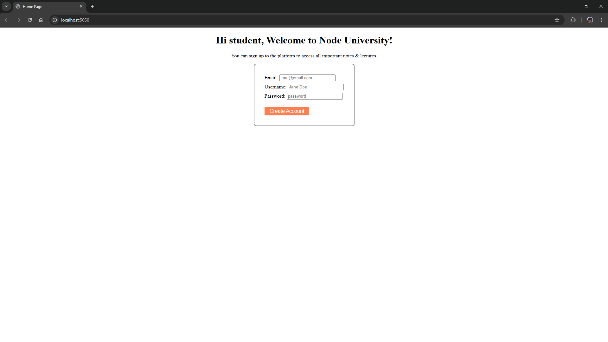
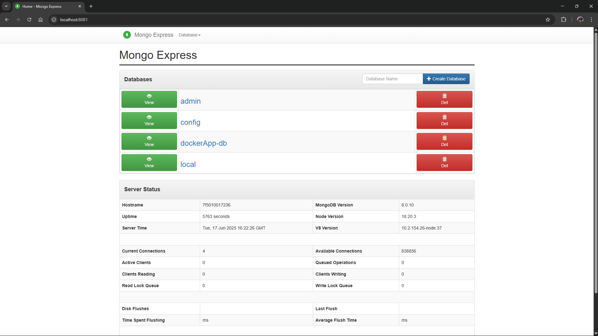
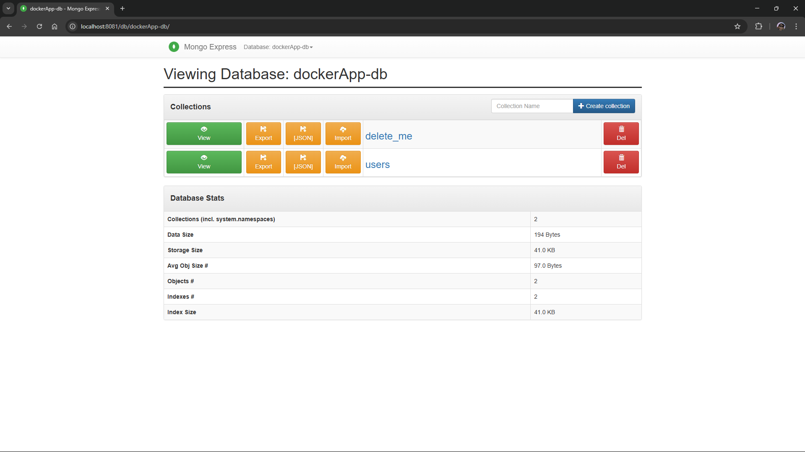
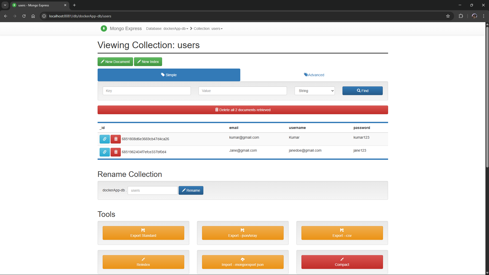
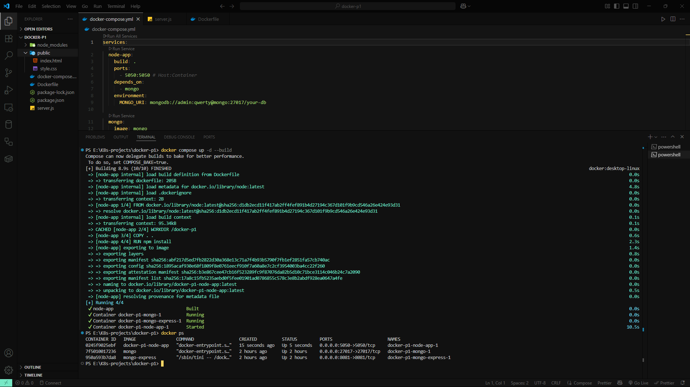
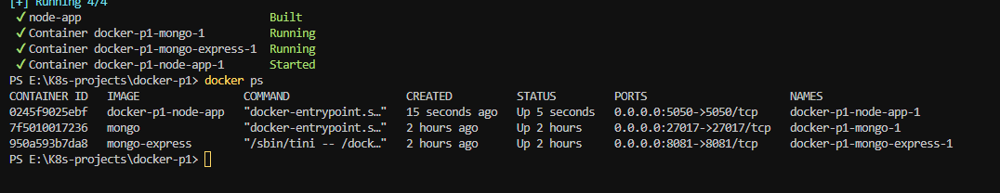
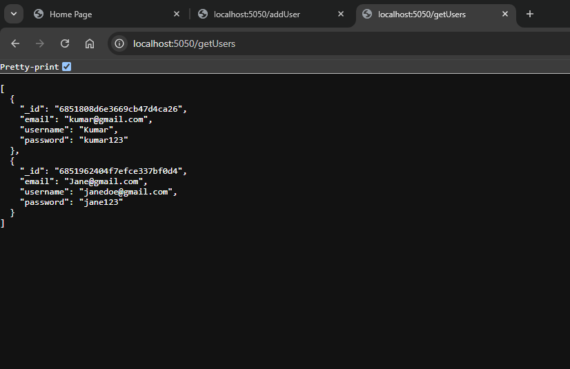
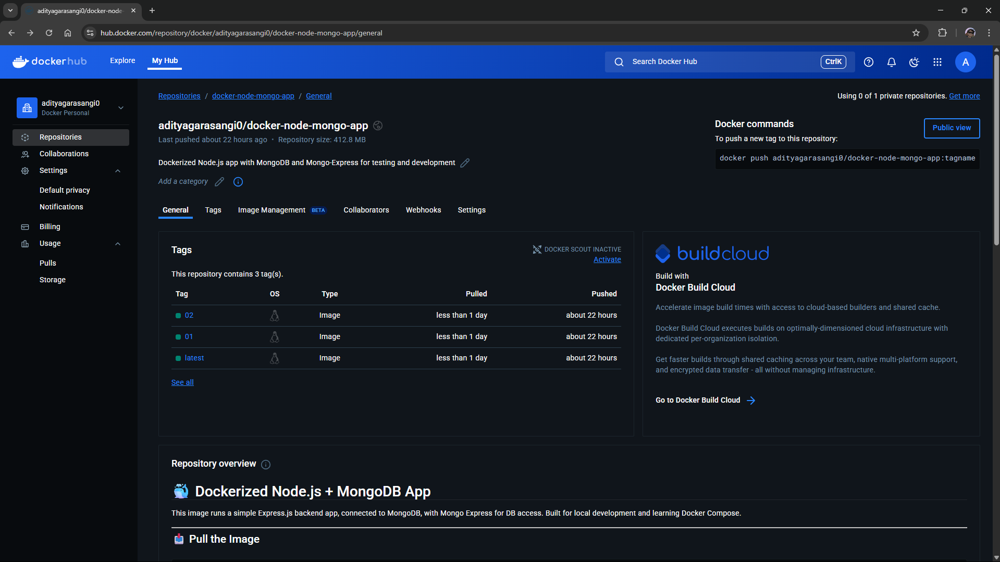

# 🐳 Dockerized Node.js + MongoDB App

A simple Express.js backend application containerized using Docker, connected to MongoDB, and integrated with Mongo Express for visual database access. This project demonstrates multi-container orchestration using Docker Compose and basic CRUD functionality via REST API.

---
## Docker Hub :
```bash
https://hub.docker.com/repository/docker/adityagarasangi0/docker-node-mongo-app/general
```
---

## 📦 Tech Stack

- Node.js (Express)
- MongoDB
- Mongo Express
- Docker & Docker Compose

---

## 🚀 How to Run

### 1. Clone the repository
```bash
git clone https://github.com/yourusername/docker-node-mongo-app.git
cd docker-node-mongo-app
```
### 2. Start the containers
```bash
docker compose up -d --build
```
### 3. Access the services
 * Node.js App: http://localhost:5050
 * Mongo Express UI: http://localhost:8081


## 📬 API Endpoints
| Method | Endpoint    | Description    |
| ------ | ----------- | -------------- |
| GET    | `/getUsers` | Get all users  |
| POST   | `/addUser`  | Add a new user |


## 💾 Docker Volumes
MongoDB data is persisted on the host using a volume:
```bash
volumes:
  - /run/desktop/mnt/host/e/data:/data/db
```
This ensures that data is retained even after containers are stopped or removed.
---
## 📷 Screenshots
### ✅ Node.js App Running
> Express app running on port 5050 with static HTML form.

---
### ✅ Mongo Express UI
> Mongo Express connected to MongoDB container.



---
### ✅ Docker Compose Up
> Docker Compose command used to build and run services.

---
### ✅ Docker Containers Running
> `docker ps` showing all containers running with correct ports

---
### ✅ API Response – `/getUsers`
> Sample JSON output from the `/getUsers` endpoint showing user records fetched from MongoDB.

---
### ✅ Docker Hub Image
> Project image available publicly on Docker Hub.

---


## 📂 Project Structure

```pgsql
docker-node-mongo-app/
├── node_modules/
├── public/
│   ├── index.html
│   └── style.css
├── docker-compose.yml
├── Dockerfile
├── package.json
├── package-lock.json
└── server.js
```

## 🛠️ Future Improvements
 * Add health checks for services
 * Add .env file support for better config management
 * Integrate CI/CD pipeline using GitHub Actions


## 🧠 Notes
 * App connects to MongoDB via internal Docker DNS (mongo as the hostname)
 * Mongo Express provides a UI for inspecting collections and documents
 * All services are defined and managed via docker-compose.yml 
